# Hands-On Session

In the following, we will guide you through all the steps required to model, deploy, and execute a low-code model.
In this tutorial, a low-code model is modeled manually by attendees.

## Overview

The system consists of the following components:

- **Quantum Low-Code Modeler**  
  A web-based graphical modeling environment that enables the collaborative design of quantum applications. It provides visual elements to specify problems at a high level of abstraction instead of quantum circuits.

- **Backend Transformation Service**  
  A service that automatically transforms the low-code models into executable quantum circuits.

- **Qunicorn**
Middleware for the execution of quantum circuits on different quantum cloud providers.

---

## 1. Start the Services

Run the following commands to start all services:

```
git clone https://github.com/LaviniaStiliadou/2026-quancom.git
cd docker
docker-compose up
```
---

## 2. Open the Quantum Low-Code Modeler

Open the Quantum Low-Code Modeler at http://localhost:4242.

You should see the Modeler start screen:


---

## 3. Open a second tab of the Quantum Low-Code Modeler

Open a second tab of the Quantum Low-Code Modeler at http://localhost:4242 and configure this user as expert.

You should see the Modeler start screen:

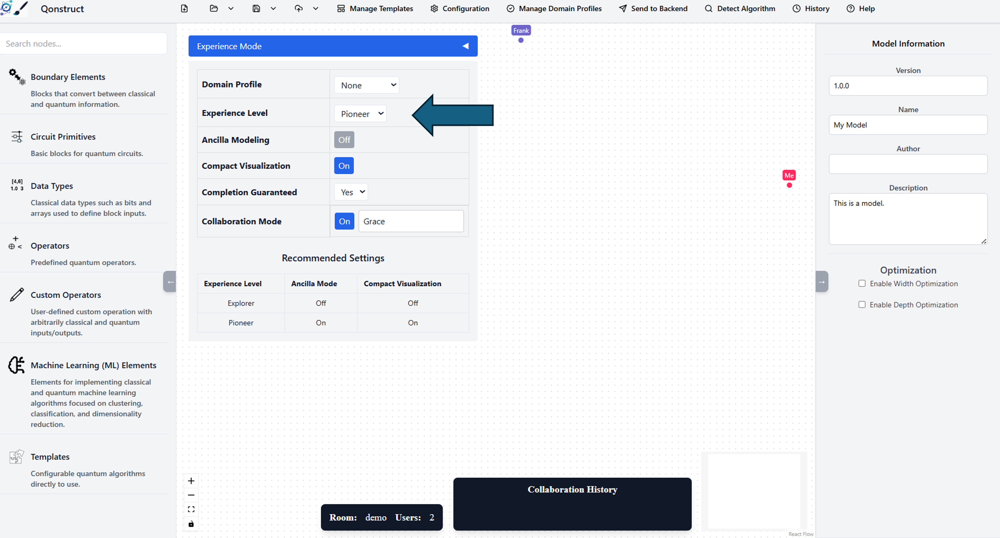

---

## 4. Start the collaborative mode in both modeler

Click on "Experience Mode" and enable "Collaboration Mode".
As illustrated in the picture, you should see now two users and two cursors.

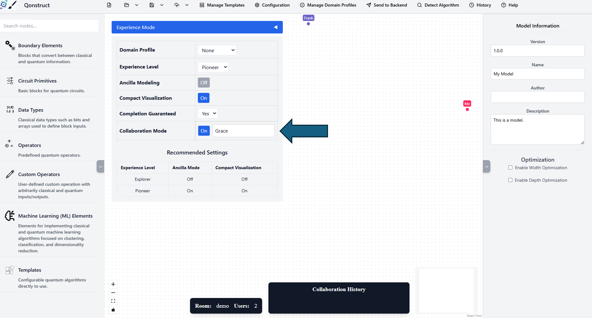
---


## 5. Start Modeling

Open the "Boundary Elements" category and drag the "Prepare State" out.
In case you want to skip the modeling, you can directly import the 
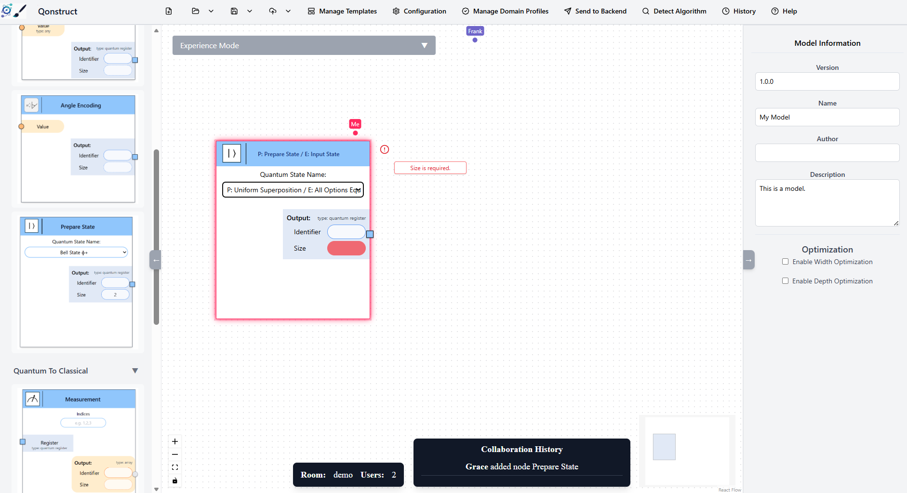


## 6. Add Oracle & Diffuser 

Open the "Operators" category with the subcategory "Quantum operators" and drag the "Oracle" and "Grover Diffuser" out.
Connect all the tasks together.

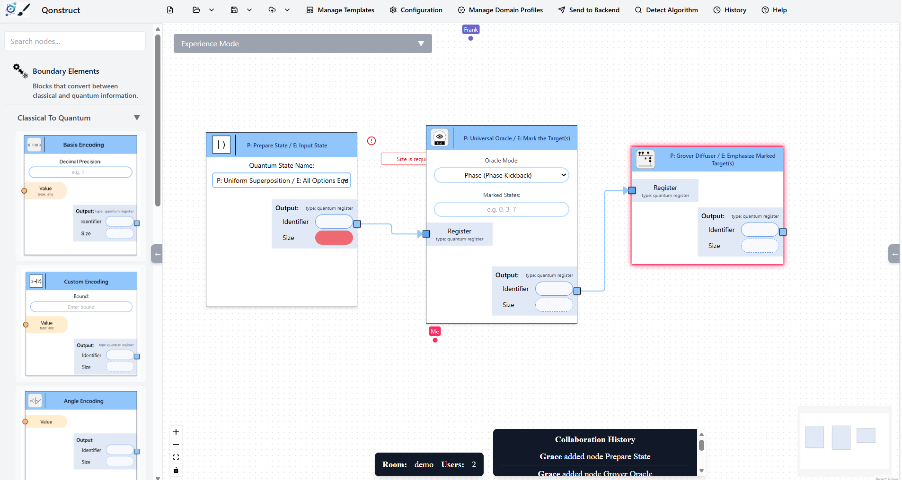

## 7. Add Measurement & missing attributes

Open the "Boundary Elements" category and drag the "Measurement" out.
Connect the "Diffuser" to the "Measurement".

Furthermore, let the other user add the size & oracle value and observe that the model gets synchronized.
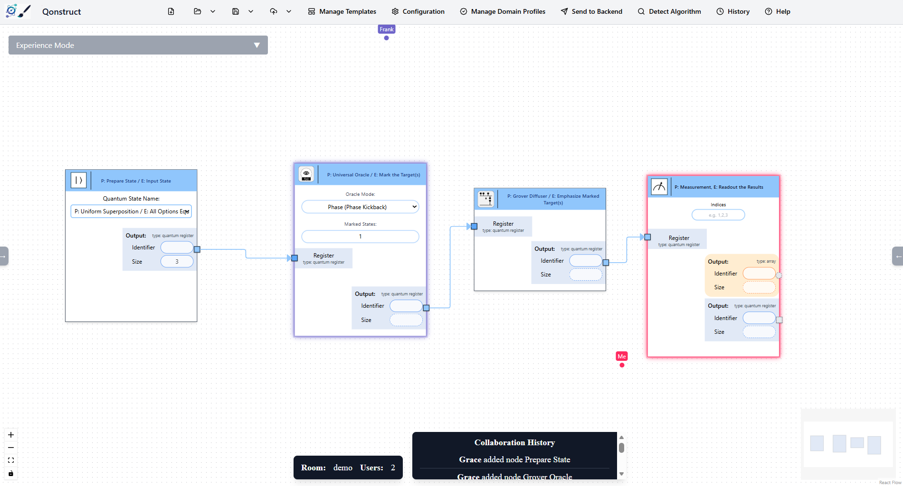

---

## 8. Transform the Model

Click "Send to Backend" to transform the domain model into an executable circuit.
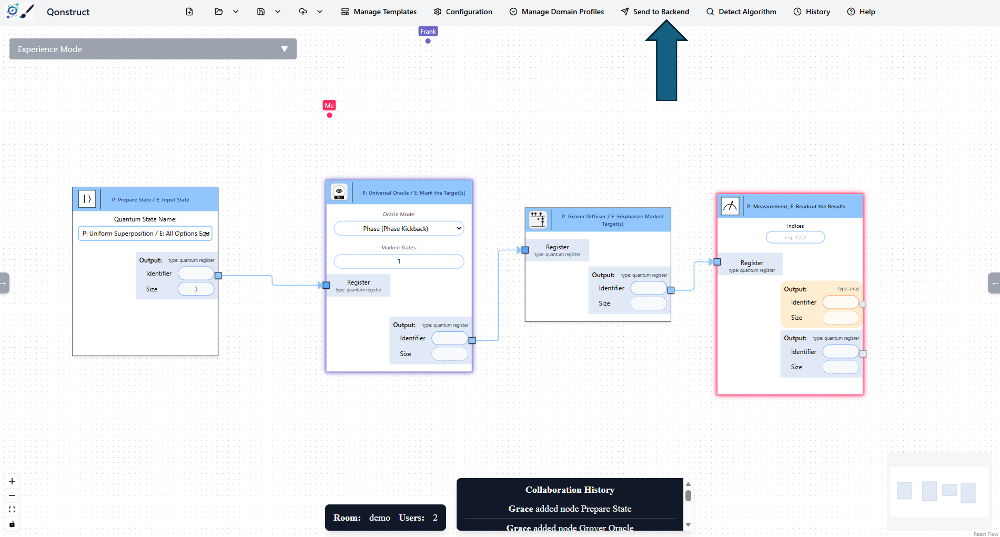

Now the validation opens up, but these are only warnings that can be skipped, so click on "Continue".
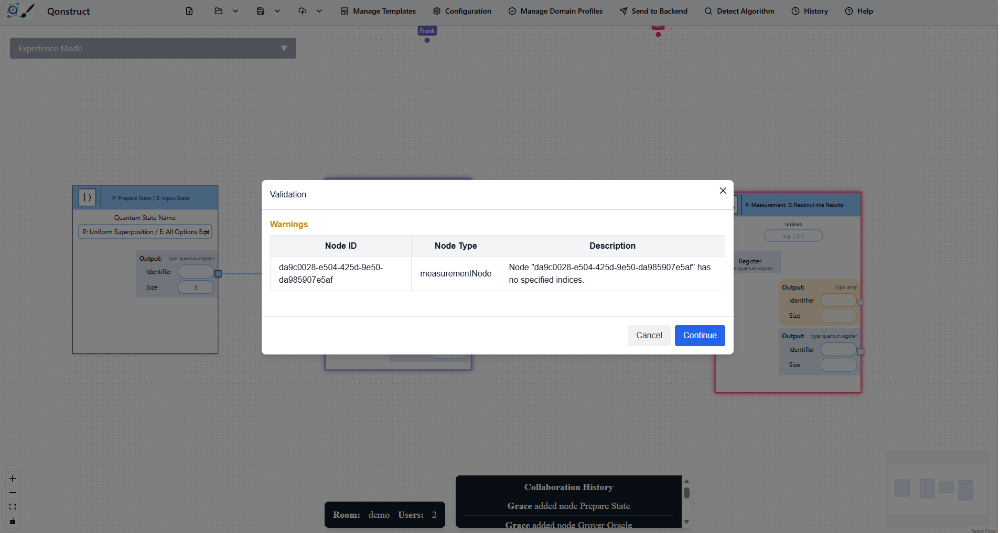

Select "OpenQASM3" as transformation target.

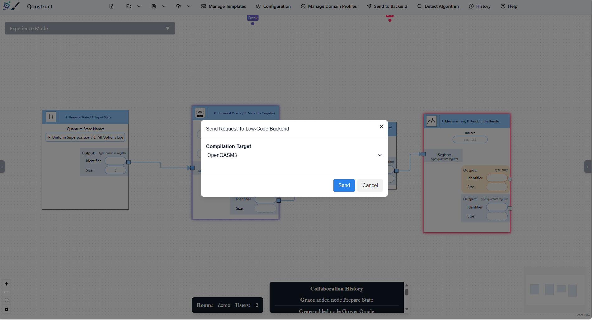
---

## 9. Execute the Model

Click "History".
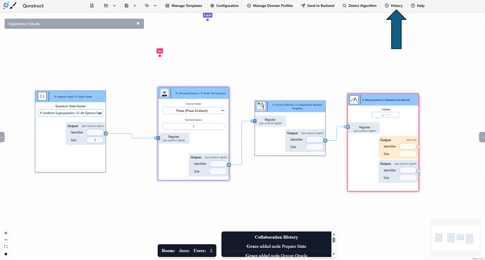

Now select the model that you want to execute by clicking on "Execute Circuit". 
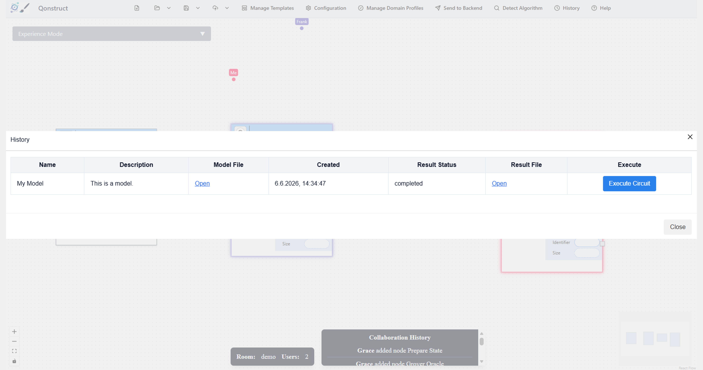

Continue by clicking the blue buttons to start the execution.

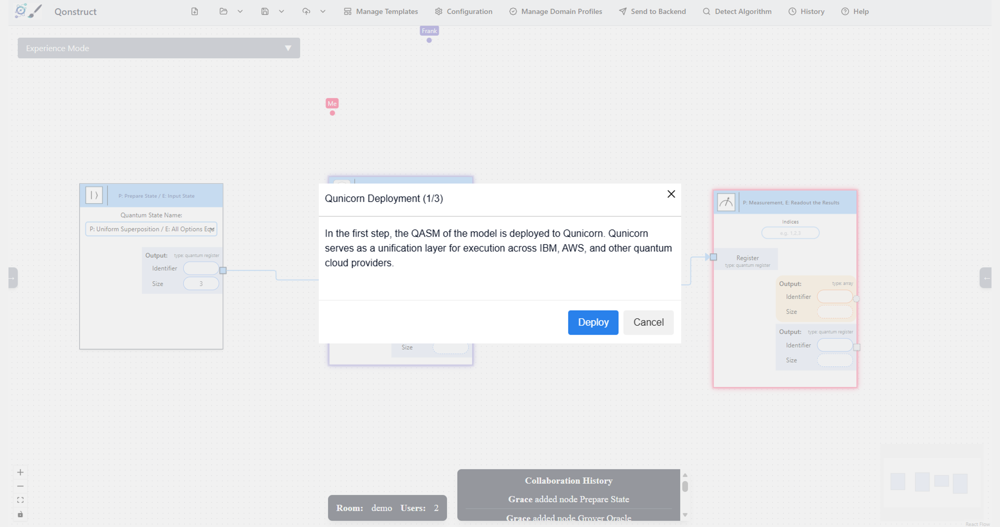
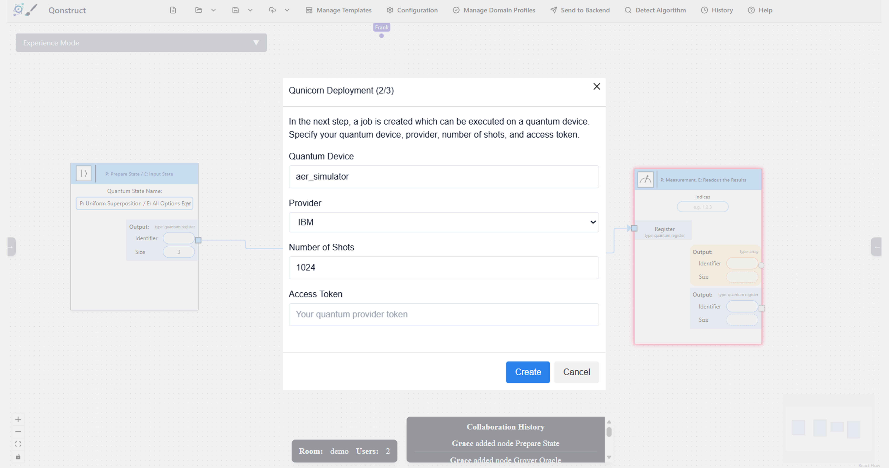
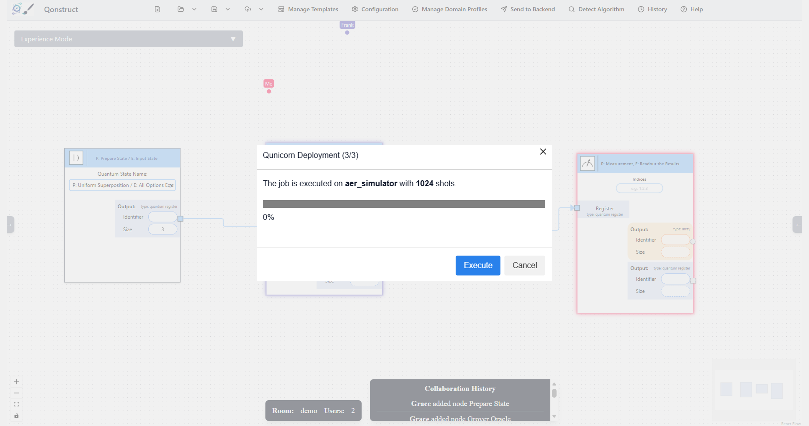
---

## 10. View the Result 

When the execution is finished, you can see that the element "1" is found.

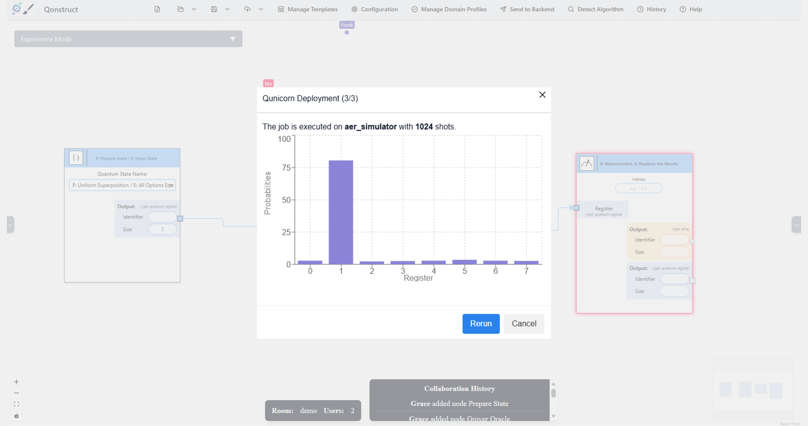
---


## Disclaimer of Warranty
Unless required by applicable law or agreed to in writing, Licensor provides the Work (and each Contributor provides its Contributions) on an "AS IS" BASIS, WITHOUT WARRANTIES OR CONDITIONS OF ANY KIND, either express or implied, including, without limitation, any warranties or conditions of TITLE, NON-INFRINGEMENT, MERCHANTABILITY, or FITNESS FOR A PARTICULAR PURPOSE. You are solely responsible for determining the appropriateness of using or redistributing the Work and assume any risks associated with Your exercise of permissions under this License.

## Haftungsausschluss
Dies ist ein Forschungsprototyp. Die Haftung für entgangenen Gewinn, Produktionsausfall, Betriebsunterbrechung, entgangene Nutzungen, Verlust von Daten und Informationen, Finanzierungsaufwendungen sowie sonstige Vermögens- und Folgeschäden ist, außer in Fällen von grober Fahrlässigkeit, Vorsatz und Personenschäden, ausgeschlossen.
