---

title: Hands-On Session 1
layout: default
navigation_weight: 3
---


# Hands-On Tutorial: Collaborative Model-Driven Quantum Software Engineering: A Hands-On Tutorial with Qonstruct Part 1


This practical session guides participants through the end-to-end lifecycle of a quantum application using the Qonstruct framework. The tutorial emphasizes a **visual, model-driven quantum model**, where participants design quantum algorithms using a low-code environment and execute them via automated compilation and quantum middleware.

Participants will explore how high-level quantum models are transformed into executable circuits and deployed on quantum backends without requiring direct circuit-level programming.

---

## Architectural Components

The underlying framework consists of three integrated core services:

* **Quantum Low-Code Modeler:** A web-based graphical workspace enabling collaborative visual modeling of quantum algorithms. It allows users to define quantum workflows at a high level of abstraction instead of manually specifying quantum circuits.
* **Backend Transformation Service:** A compiler engine that validates visual quantum models and automatically transforms them into executable quantum circuits (OpenQASM3) or workflows.
* **Qunicorn:** A middleware layer for orchestrating execution of quantum circuits across heterogeneous quantum cloud providers and simulators.

---

## Step 1: Initialize the Services

Execute the following commands in your terminal to launch the containerized infrastructure:

```bash
git clone https://github.com/LaviniaStiliadou/2026-quantics.git
cd docker
docker-compose up -d
```

---

## Step 2: Access the Workspace Layout

Open your primary web browser window and navigate to the application ecosystem endpoint:

**URL:** `http://localhost:4242`

The interface will initialize with the default visual modeling canvas.
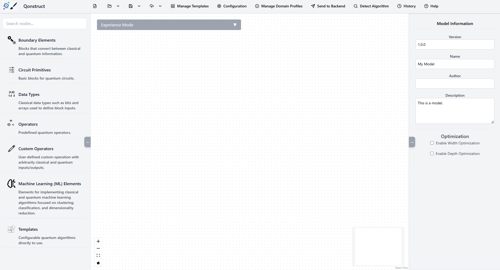

---

## Step 3: Create the Initial Quantum Register

We will implement Grover's Search Algorithm using three qubits.

1. In the left toolbox, expand Circuit Primitives.
2. Drag three Qubit elements onto the modeling canvas.

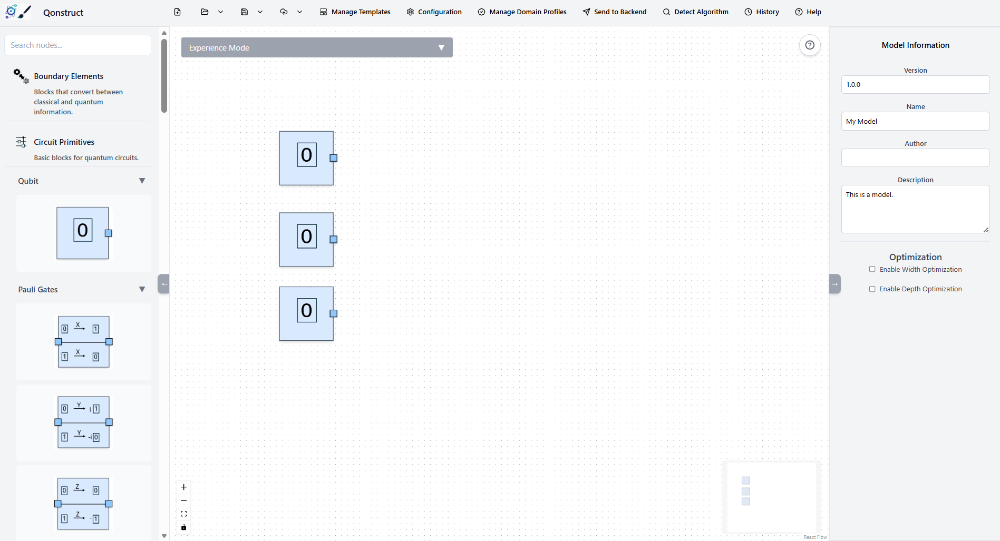

3. Under Circuit Primitives → Basis Change, locate the Hadamard (H) gate.
4. Drag one Hadamard gate onto the canvas.
5. Connect each qubit to its corresponding Hadamard gate.

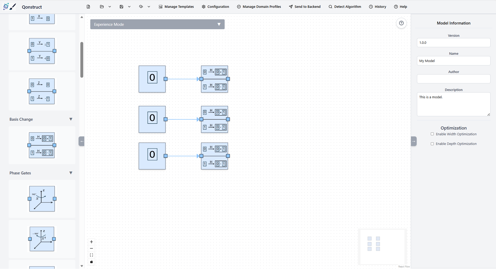

At this point, each qubit is placed into an equal superposition, creating the initial search space.


## Step 4: Build the Oracle

In this example, the marked (target) state is |000⟩.

1. Open Circuit Primitives → Pauli Gates.
2. Drag three Pauli-X (X) gates
3. Connect the Hadamard gates to the Pauli-X gates.

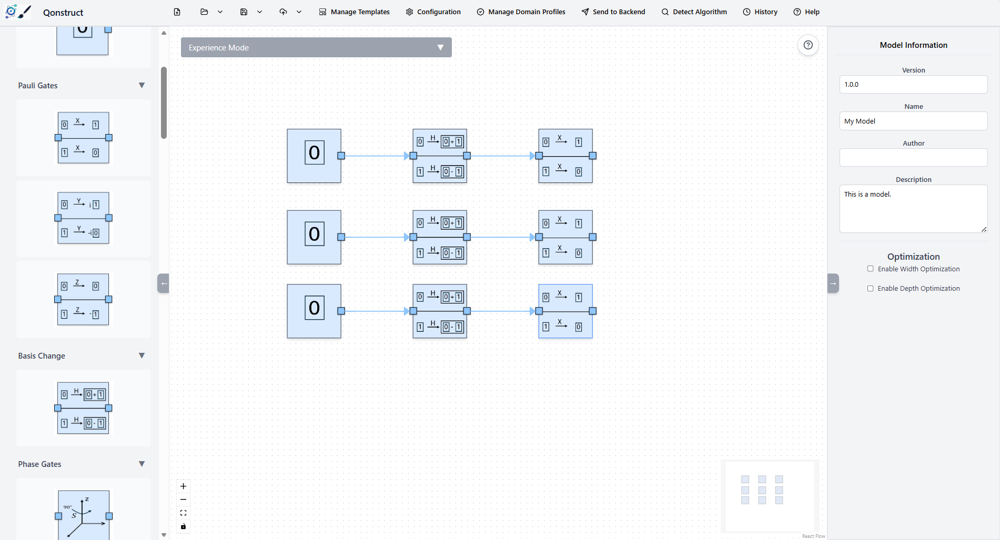

4. Open Circuit Primitives → Multi-Control Gates.
5. Drag an MCMT gate onto the canvas.
6. Configure the gate with the following properties:
- Operation (U): Z
- Number of Controls: 2
- Number of Targets: 1
- Connect the three qubits to the MCMT gate.

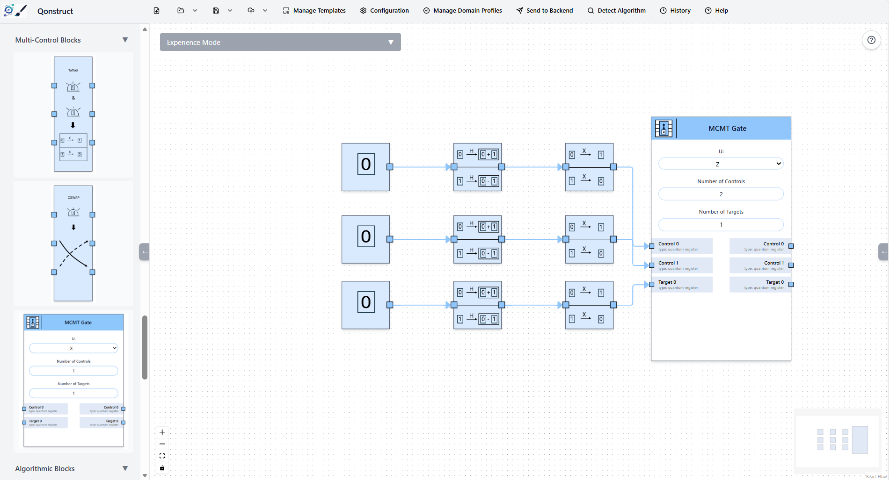

7. Add another Pauli-X gate to each qubit.
8. Connect the outputs of the MCMT gate to these X gates.

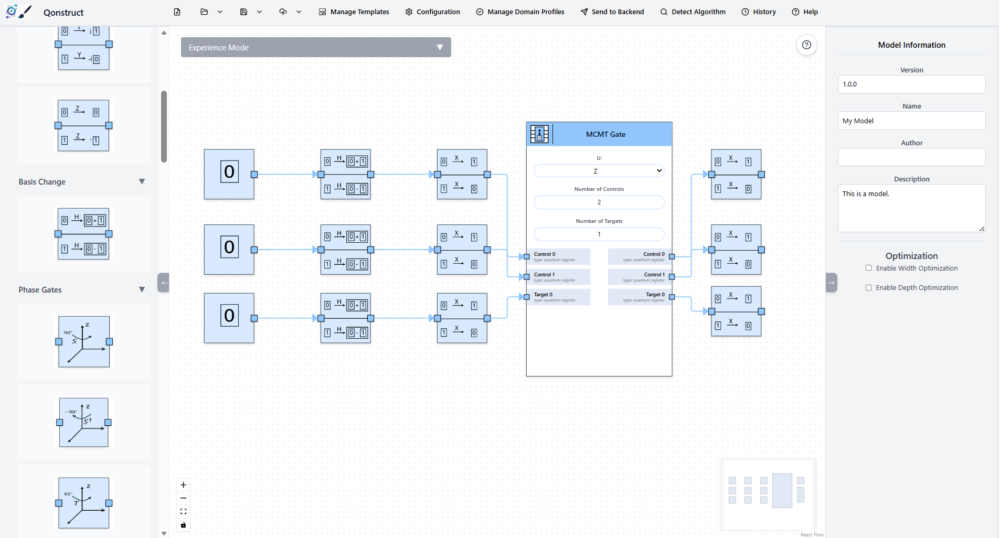

The oracle is now complete and marks the state |000⟩ by applying a phase inversion.

## Step 5: Build the Diffusion Operator

The diffusion operator amplifies the probability of measuring the marked state.

1. Add a Hadamard gate to the canvas so connect the output of the X gate with a Hadamard gate.
2. Add the MCMT Gate
3. Configure it as follows:
- Operation (U): Z
- Number of Controls: 2
- Number of Targets: 1
- Connect all three qubits to the gate.
4. Add another Pauli-X gate and connect it with the outputs of the MCMT gate.
5. Follow each X gate with a Hadamard gate.

The diffusion operator is now complete.
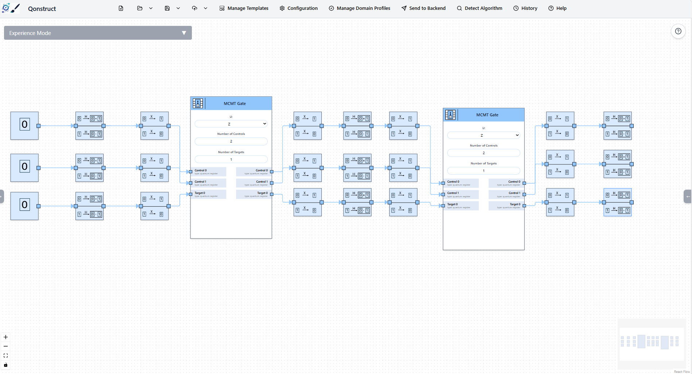

## Step 6: Merge the Qubit Paths

To reduce the number of blocks, we merge the three qubits into one quantum register.

1. Open Circuit Primitives and under Utilities you find the Merger.
2. Drag a Merge element onto the canvas.
3. Right click on the element and click on add input.
3. Connect the outputs of the three qubit paths to the Merge element.
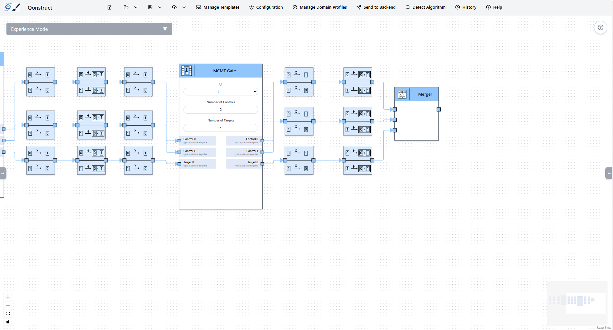

## Step 7: Measure the Result
Open Boundary Elements.
Navigate to the Quantum to Classical subcategory and drag a Measurement element onto the canvas.
Connect the output of the Merge element to the Measurement element.

The circuit is now complete. After execution, the measurement should return the marked state |000⟩ with a high probability, demonstrating the successful operation of Grover's search algorithm.

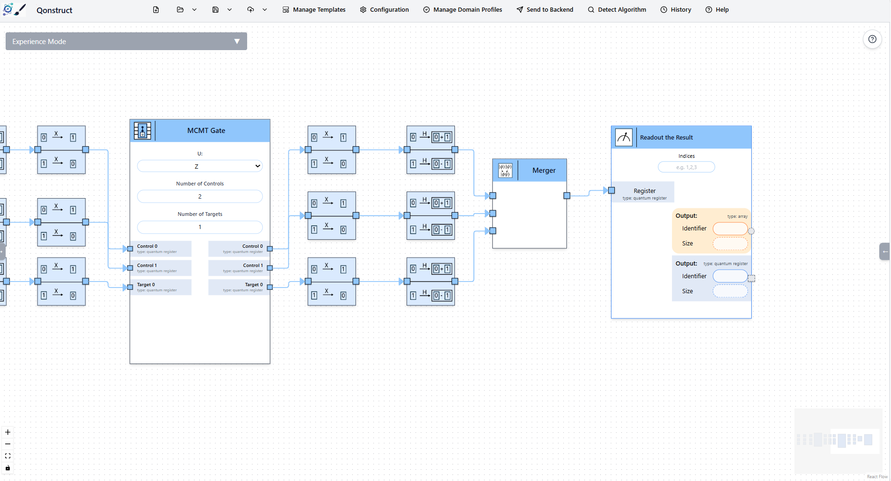


## Step 8: Trigger the Model-to-Code Transformation

Select the **Send to Backend** execution action trigger located on the top application toolbar.

The transformation engine will validate the schema. Click **Continue** to progress past non-blocking verification or optimization notices.

Define **OpenQASM3** as your programmatic compilation target format.
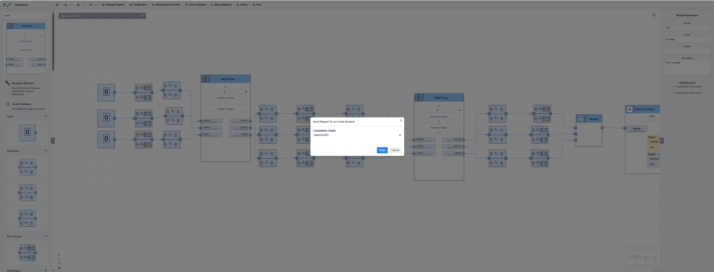

---

## Step 9: Queue and Orchestrate Deployment

Navigate to the **History** workspace module to review generated build artifacts.

Locate your newly compiled OpenQASM3 sequence matrix and select **Execute Circuit**.

Advance through the structural blue prompt indicators to hand off the execution configuration safely to the Qunicorn service router.
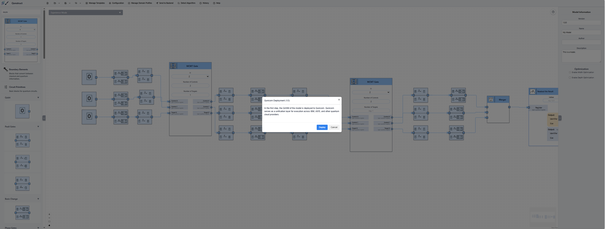
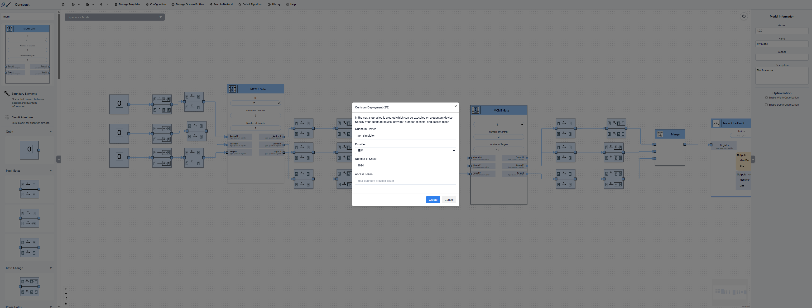
---

## Step 10: Analyze Hardware Target Output

Once the runtime pipeline tasks finish processing inside the middleware execution queue, the interface displays the return registers.

The peak value amplification verifies successful tracking of the target data element ( |000\rangle ), completing the low-code example.
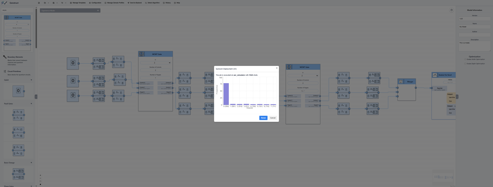

---

# Legal Notices

## Disclaimer of Warranty

Unless required by applicable law or agreed to in writing, Licensor provides the Work (and each Contributor provides its Contributions) on an "AS IS" BASIS, WITHOUT WARRANTIES OR CONDITIONS OF ANY KIND, either express or implied, including, without limitation, any warranties or conditions of TITLE, NON-INFRINGEMENT, MERCHANTABILITY, or FITNESS FOR A PARTICULAR PURPOSE.
You are solely responsible for determining the appropriateness of using or redistributing the Work and assume any risks associated with Your exercise of permissions under this License.

## Haftungsausschluss

Dies ist ein Forschungsprototyp.
Die Haftung für entgangenen Gewinn, Produktionsausfall, Betriebsunterbrechung, entgangene Nutzungen, Verlust von Daten und Informationen, Finanzierungsaufwendungen sowie sonstige Vermögens- und Folgeschäden ist, außer in Fällen von grober Fahrlässigkeit, Vorsatz und Personenschäden, ausgeschlossen.
