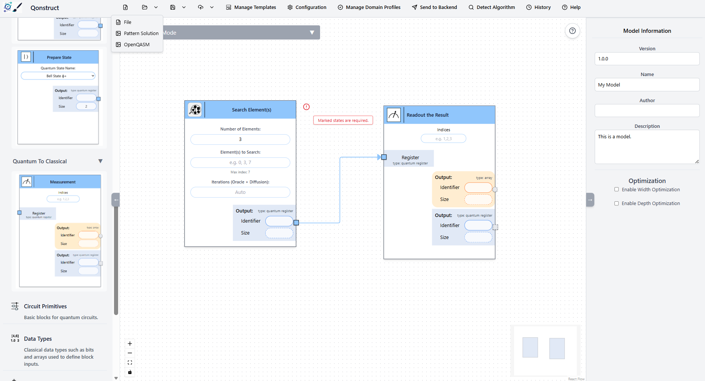
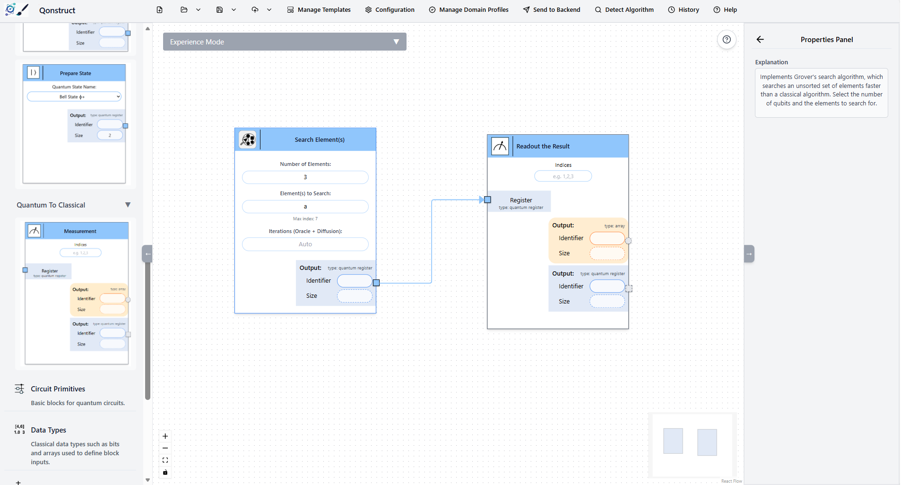
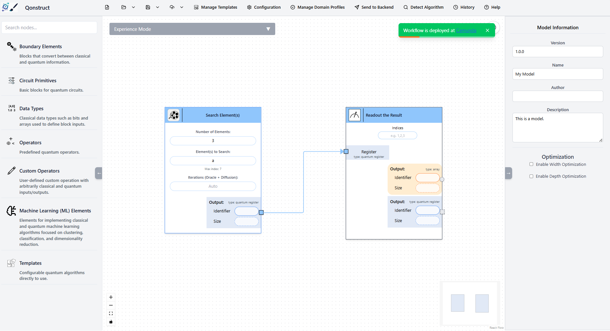
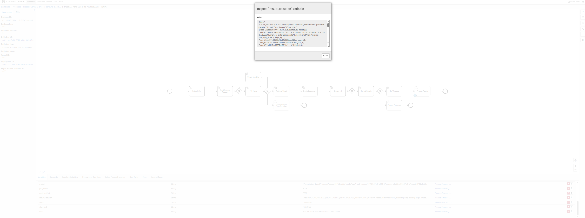

---

title: Hands-On Session 3
layout: default
navigation_weight: 5
---


# Hands-On Tutorial: Collaborative Model-Driven Quantum Software Engineering: A Hands-On Tutorial with Qonstruct Part 3

This practical session guides participants through the end-to-end lifecycle of a quantum application using the Qonstruct framework. The tutorial emphasizes a **visual, model-driven quantum model**, where participants design quantum algorithms using a low-code environment and execute them via automated compilation and quantum middleware.

Participants will explore how high-level quantum models are transformed into executable circuits and deployed on quantum backends without requiring direct circuit-level programming.


## Architectural Components

The underlying framework consists of three integrated core services:

* **Quantum Low-Code Modeler:** A web-based graphical workspace enabling collaborative visual modeling of quantum algorithms. It allows users to define quantum workflows at a high level of abstraction instead of manually specifying quantum circuits.
* **Backend Transformation Service:** A compiler engine that validates visual quantum models and automatically transforms them into executable quantum circuits (OpenQASM3) or workflows.
* **Qunicorn:** A middleware layer for orchestrating execution of quantum circuits across heterogeneous quantum cloud providers and simulators.

---

## Step 1: Initialize the Services

Execute the following commands in your terminal to launch the containerized infrastructure:

```bash
git clone https://github.com/LaviniaStiliadou/2026-icsoft.git
cd docker
docker-compose up -d
```

---

## Step 2: Access the Workspace Layout

Open your primary web browser window and navigate to the application ecosystem endpoint:

**URL:** `http://localhost:4242`

The interface will initialize with the default visual modeling canvas.


---
## Step 3: Import the Model

In the toolbar, click the **Folder** icon and select **Import File**. Choose the provided `model.json` file to load the preconfigured quantum model into the editor.


---

## Step 4: Adapt the Parameters

Change the **Element to Search Value** in the model to

```text
a
```

This specifies the element that Grover's algorithm will search for during execution.


---

## Step 5: Transform the Model into a Workflow

The imported model contains placeholder elements that must be converted into executable workflow components.

Click **Send to Backend** in the toolbar. The editor will automatically generate the corresponding workflow model.

---

## Step 6: Deploy the Workflow

Open the **History** panel and select the workflow you have just generated (it appears at the top of the list).

Click **Deploy Workflow** and choose **Camunda** as the deployment target.

Alternatively, you can open the Camunda web interface directly by navigating to:

**URL:** `http://localhost:8090`

---

## Step 7: Execute the Workflow

1. Open the **Camunda Tasklist**.
2. Log in using the following credentials:
   - **Username:** `demo`
   - **Password:** `demo`
3. Click **Start Process**.
4. Enter your IP address.
5. Provide a value for **a**, for example:

   ```text
   1
   ```

6. Click **Start** to execute the workflow.

---

## Step 8: View the Result

After the workflow has finished executing, open the completed process instance.

Inspect the **ResultExecution** process variable. The result shows that the element with the value **1** has been successfully identified as the searched element by Grover's algorithm.


---

# Legal Notices

## Disclaimer of Warranty

Unless required by applicable law or agreed to in writing, Licensor provides the Work (and each Contributor provides its Contributions) on an "AS IS" BASIS, WITHOUT WARRANTIES OR CONDITIONS OF ANY KIND, either express or implied, including, without limitation, any warranties or conditions of TITLE, NON-INFRINGEMENT, MERCHANTABILITY, or FITNESS FOR A PARTICULAR PURPOSE.
You are solely responsible for determining the appropriateness of using or redistributing the Work and assume any risks associated with Your exercise of permissions under this License.

## Haftungsausschluss

Dies ist ein Forschungsprototyp.
Die Haftung für entgangenen Gewinn, Produktionsausfall, Betriebsunterbrechung, entgangene Nutzungen, Verlust von Daten und Informationen, Finanzierungsaufwendungen sowie sonstige Vermögens- und Folgeschäden ist, außer in Fällen von grober Fahrlässigkeit, Vorsatz und Personenschäden, ausgeschlossen.
